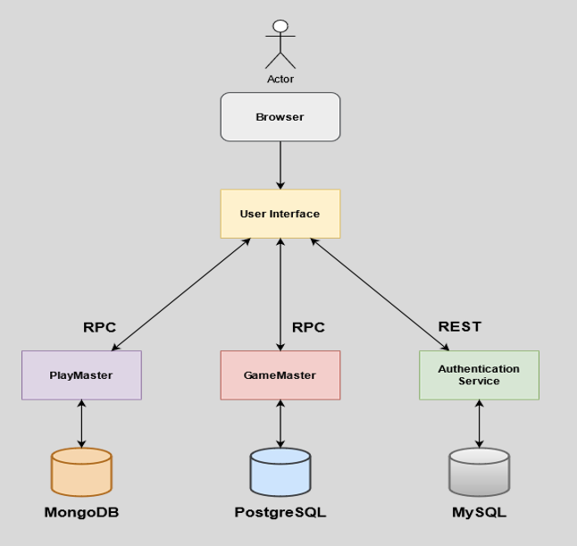

### About the Project
This Project was part of the Distributed Systems course of ECE Technical University of Crete.

# Distributed Game Engine
A distributed game engine for playing multiplayer board games (chess and tic-tac-toe), as a distributed system. The platform supports user-authentication, access and authorization along with score boards and tournaments.

# Getting Started
There are 2 possible ways of running the distributed game engine application:

1. Using minikube to simulate a Kubernetes cluster with one Node (prefered way since it provides fault-tolerance) and the kubectl tool.
2. Using the docker engine and the docker-compose tool.

# Architecture

|Service|Description|
|-------|-----------|
|User Interface Service|The frontend service of the application written in **JavaScript with NodeJS and Express**, provides a web-based interface and uses **AJAX** to update asynchronously data.|
|Authentication Service|Exposes a **REST API** for user data management. Supports _GET/POST/DELETE/PUT_  HTTP methods. Authenticates users by issuing and checking **JWT Tokens**. Written in Javascript with NodeJS and Express.|
|GameMaster Service|Written in JavaScript, this service uses **gRPC** to acquire and store player scores, create and manage tournaments, as well as matchmake players together.|
|GamePlay Service|Written in JavaScript, this service uses **gRPC** to acquire the state of games and manage individual plays.|
|[MySQL](https://www.mysql.com/)|Used to store all the user data.|
|[MongoDB](https://www.mongodb.com/)|Used to store the state of all the games that have not been finished along with individual plays made.|
|[PostgreSQL](https://www.postgresql.org/)|Used to store the results, points and history of all the games that have been played in practice or tournament mode.|
|[pgAdmin](https://www.pgadmin.org/) [Express](https://github.com/mongo-express/mongo-express) [phpMyAdmin](https://www.phpmyadmin.net/)|(Optional for the execution of the application) Services that provide GUI's for the data of each database.|

## Tools, frameworks and Libraries used
* [Express](https://expressjs.com/)
* [Bootstrap](https://getbootstrap.com/docs/3.4/css/)
* [gRPC](https://grpc.io/)
* [Sequelize ORM](https://sequelize.org/)
* [Mongoose ODM](https://mongoosejs.com/pos)
* [Postman](https://www.postman.com/)
* [Apache Bench](https://httpd.apache.org/docs/2.4/programs/ab.html)
* [Ghz](https://github.com/bojand/ghz) for RPC performance testing

# Credits

* [Chess](https://github.com/jhlywa/chess.js)
* [Chessboard](https://chessboardjs.com/)
* [Tic-Tac-Toe](https://dev.to/bornasepic/pure-and-simple-tic-tac-toe-with-javascript-4pgn)